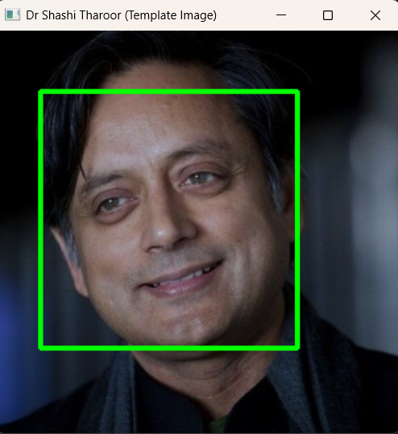
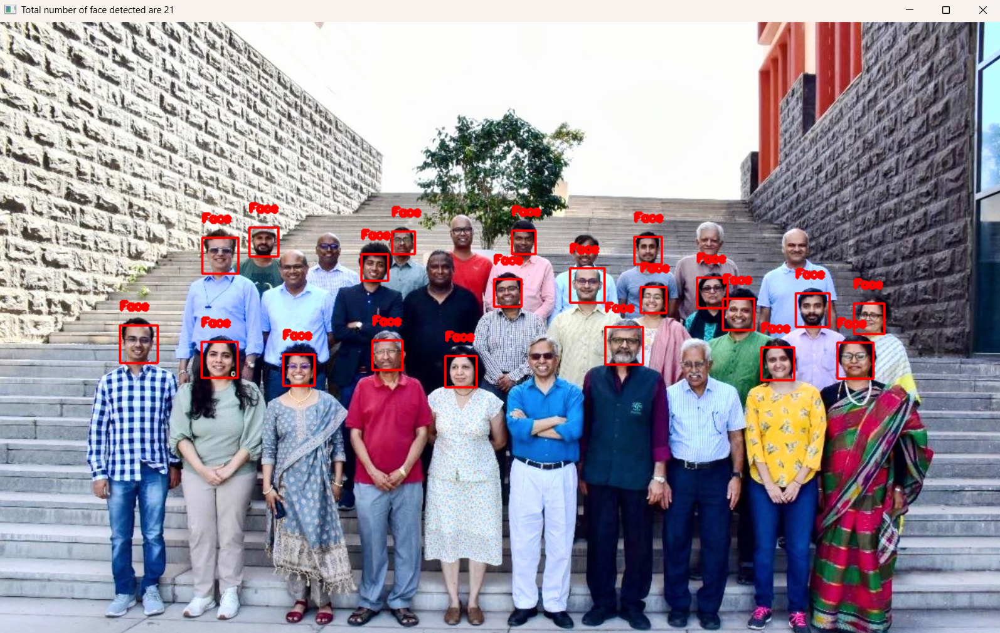
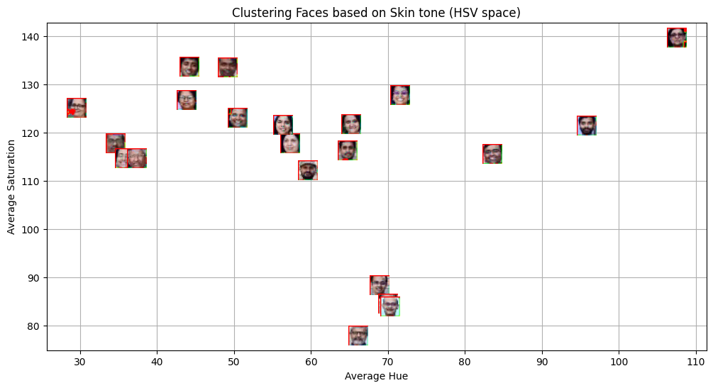
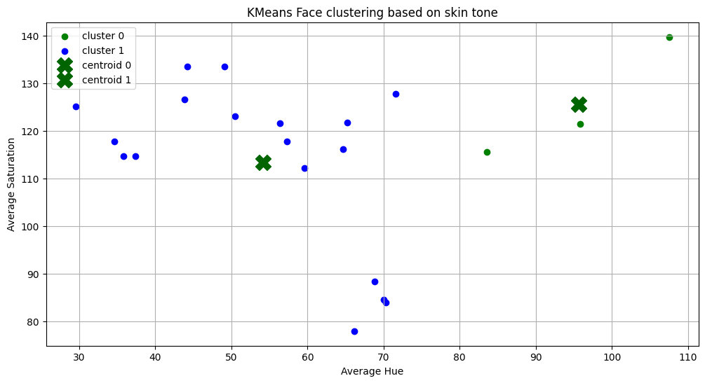
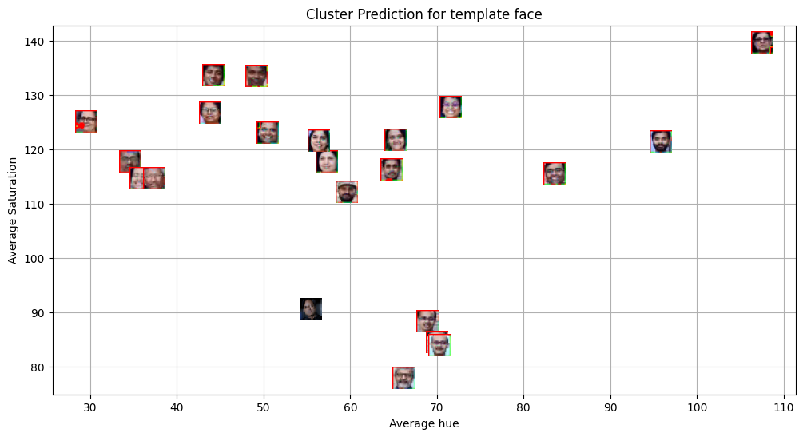
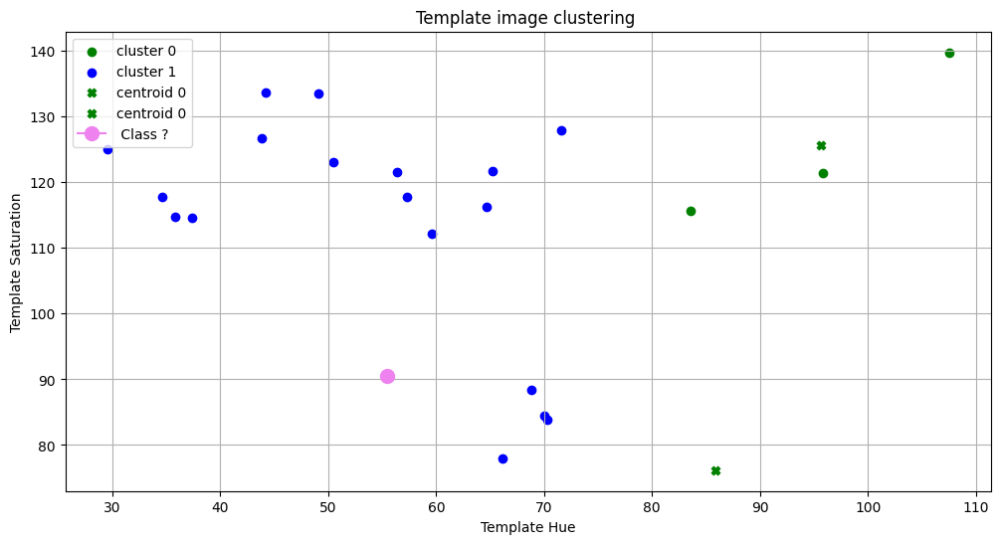

# MLPR-LAB-5 
# Face Detection and Clustering using Classical Computer Vision

**Name:** Kanishk Khandelwal  
**UID:** U20240032

---

## Overview

This Lab implements computer vision for face detection:

1. Detects faces in a group photograph  
2. Extracts appearance-based features (HSV color descriptors)  
3. Groups visually similar faces using K-Means clustering  
4. Predicts which group a new template face belongs to  

---

## Aim

To build an interpretable image-processing pipeline that groups similar faces in a photograph using unsupervised learning and evaluates how well simple color features represent identity.

---

## Methodology

### 1. Face Detection

We use the Haar Cascade classifier to locate faces in an image.

**Steps**
- Convert image to grayscale
- Scan image using sliding windows
- Detect facial structure patterns (eyes, nose bridge, symmetry)

**Algorithm:** Viola–Jones Haar Cascade

---

### 2. Feature Extraction

Each detected face is converted into a compact numerical representation.

Instead of using all pixels, we compute:

- Average **Hue (H)**
- Average **Saturation (S)**

---

### 3. Clustering (Unsupervised Learning)

We apply **K-Means clustering** to group visually similar faces.

K-Means groups faces by minimizing distance to cluster centers:

Distance = sqrt((H1-H2)^2 + (S1-S2)^2)

The result is groups of faces with similar skin tone and appearance.

---

### 4. Template Prediction

A new face image is processed using the same pipeline:

- Convert to HSV
- Extract features
- Assign nearest cluster

This demonstrates inference in a trained ML pipeline.

---

## Visualisations

### Template image(Plaksha faculty)

### Template image(Dr Shashi Tharoor)

### Face Detection Output

### Feature Space Distribution

### Template Classification

---

## Key Findings

1. Faces with similar skin tone cluster together even if they are different people.
2. Color features are insufficient for identity recognition.
3. Lighting conditions strongly affect clustering accuracy.
4. Classical computer vision can group appearances but cannot uniquely identify individuals.

---

## Conclusions

1. Classical computer vision techniques can reliably detect faces and group visually similar appearances, but simple color-based features do not uniquely represent identity.

2. Illumination changes and similar skin tones significantly influence clustering results, demonstrating the limitations of handcrafted features for recognition tasks.

3. The results establish that detection and appearance grouping are fundamentally different from true face recognition, which requires learned feature representations such as facial embeddings.

---

## Limitations

- Sensitive to lighting
- Fails under shadows and occlusion
- Cannot distinguish people with similar appearance

---
